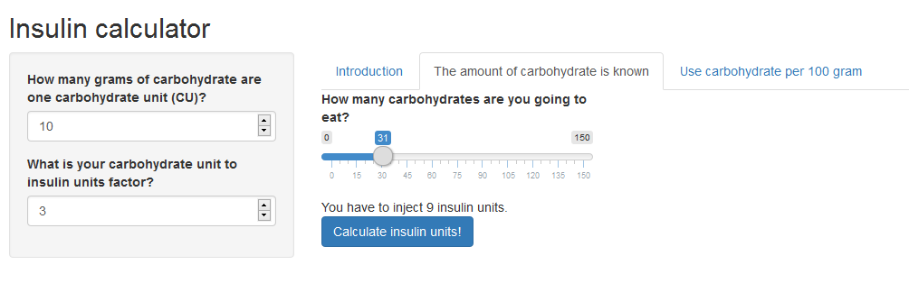

```{r setup, include=FALSE}
knitr::opts_chunk$set(echo = TRUE)
```

## Insulin Calculator
<br>
Diabetes is a serious and widespread disease.
<br><br>
Especially people who suffer from type 1 diabetes have to live with it for their whole live. Before every meal they have to calculate and inject some insulin. Goal of this project is to develop an easy to use calculator to help figuring out, how much insulin one is supposed to inject before the meal.

## Insulin Calculator
<br>
The theory behind calculating the amount of insulin is not hard. At first we need to know how much carbohydrate we are going to eat. For this example I am going to assume 100 gram of carbohydrate. Now we need to know how many carbohydrate units 100 gram of carbohydrate are.
```{r}
 carbohydrate <- 100
 cu_factor <- 11
 cu <- floor(carbohydrate / cu_factor)
```

Assuming a factor of `r cu_factor` we have `r cu` carbohydrate units. The factor is not a fixed amount and can set to a specific value in the application.

Next we need to multiply it with another factor, which is highly individual and determined together with the doctor. 
```{r}
 insulin_factor <- 2
 insulin <- cu * insulin_factor
```

Again, the insulin factor can be set inside the app. Assuming a value of `r insulin_factor` one needs to inject `r insulin` insulin units.

## Insulin Calculator
<br>
This app gives a small idea on how to calculate insuline, a task people with diabetes type 1 have to do several times a day.

<center></center>

## Insulin Calculator
<br>
If you want to try the app please go here: <a href='https://pwuestli.shinyapps.io/Insulin_Calculator/'> Insulin Calculator</a>.
<br>
<br>
If you want to have a look at the source code you can find in on <a href='https://github.com/pwuestli/datasciencecoursera/tree/master/Course9/week%204%20project'> Github</a>.

